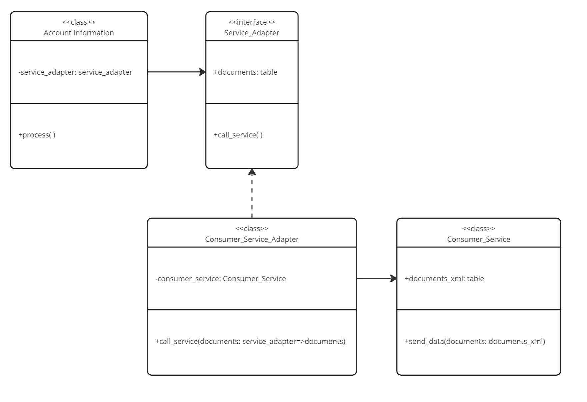

Assuming that we have following situtation:



The client "account information" has to send information about document positions to a external system. The client itself creates the 
documents with a specific structure. This structure does not match with that own the external system expects (XML format).

To convert the document information especially for the calles service which transfers the data to the external system we introduce an 
adapter class "consumer service adapter" to take care of the data conversion and call of the service.

## Class Account Information (our client class)

```ABAP
CLASS ycl_account_information DEFINITION
  PUBLIC
  CREATE PUBLIC .

  PUBLIC SECTION.
    "! <p class="shorttext synchronized" lang="en"></p>
    "! Executing Business logic to create and send document informations
    METHODS process.

  PRIVATE SECTION.
    DATA service_adapter TYPE REF TO yif_service_adapter.
ENDCLASS.

CLASS ycl_account_information IMPLEMENTATION.

  METHOD process.

    DATA documents TYPE yif_service_adapter=>documents_list.
    " Create document informations in client format

    " Call serive via adapter to convert documents from client format to XML format
    service_adapter->call_service( documents ).
  ENDMETHOD.

ENDCLASS.
```

## Interface Service Adapter

```ABAP
INTERFACE yif_service_adapter
  PUBLIC .

  TYPES documents_list TYPE STANDARD TABLE OF string WITH EMPTY KEY.

  METHODS call_service IMPORTING documents TYPE documents_list.

ENDINTERFACE.
```

### Class Consumer Service Adapter

```ABAP
CLASS ycl_consumer_service_adapter DEFINITION
  PUBLIC
  CREATE PUBLIC .

  PUBLIC SECTION.
    INTERFACES yif_service_adapter.

    METHODS constructor.

  PRIVATE SECTION.
    DATA consumer_service TYPE REF TO ycl_consumer_service.

    "! <p class="shorttext synchronized" lang="en"></p>
    "! Converting data to service XML format
    "! @parameter documents | <p class="shorttext synchronized" lang="en">Documents in client format</p>
    "! @parameter result | <p class="shorttext synchronized" lang="en">Documents in XML format</p>
    METHODS convert_to_xml IMPORTING documents     TYPE yif_service_adapter=>documents_list
                           RETURNING VALUE(result) TYPE ycl_consumer_service=>xml_documents_list.

ENDCLASS.

CLASS ycl_consumer_service_adapter IMPLEMENTATION.

  METHOD constructor.
    consumer_service = NEW ycl_consumer_service( ).
  ENDMETHOD.

  METHOD yif_service_adapter~call_service.
    DATA(documents_xml) = convert_to_xml( documents ).
    consumer_service->send_data( documents_xml ).
  ENDMETHOD.

  METHOD convert_to_xml.
    " converts documents from clients format to XML format for consumer service
  ENDMETHOD.


ENDCLASS.
```

## Class Consumer Service

```ABAP
CLASS ycl_consumer_service DEFINITION
  PUBLIC
  CREATE PUBLIC .

  PUBLIC SECTION.
    TYPES xml_documents_list TYPE STANDARD TABLE OF string WITH EMPTY KEY.

    "! <p class="shorttext synchronized" lang="en"></p>
    "! Calls the webservice to transfer data in XML format to receiver system
    "! @parameter documents | <p class="shorttext synchronized" lang="en"></p>
    METHODS send_data IMPORTING documents TYPE xml_documents_list.

ENDCLASS.

CLASS ycl_consumer_service IMPLEMENTATION.

  METHOD send_data.
    " Send Data in XML format to other system
  ENDMETHOD.

ENDCLASS.
```

